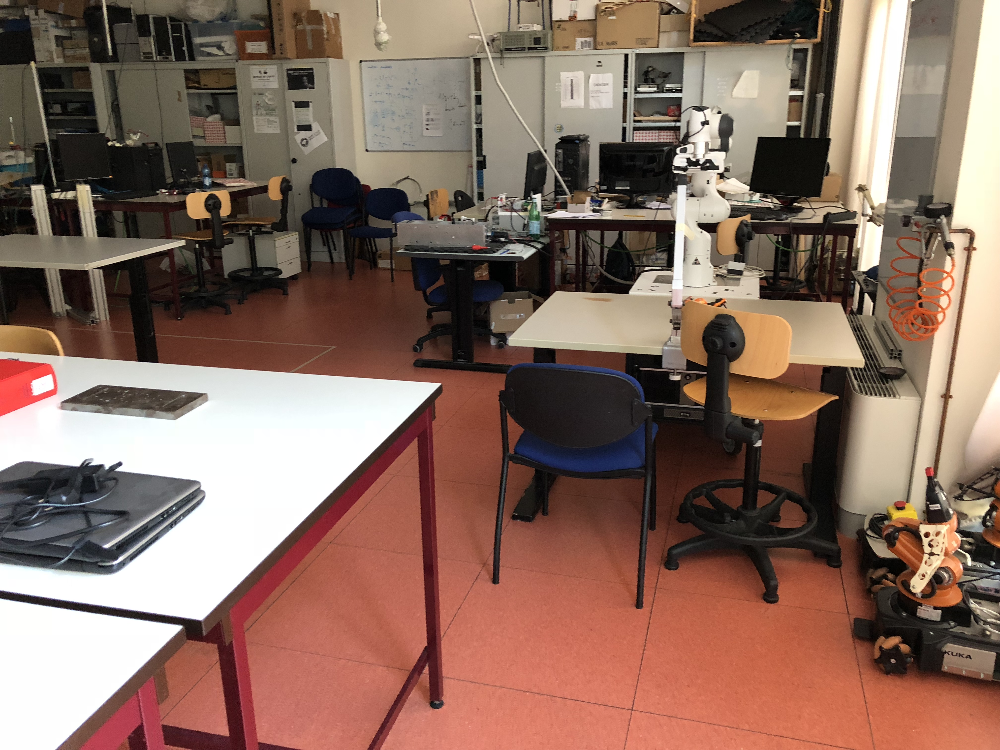
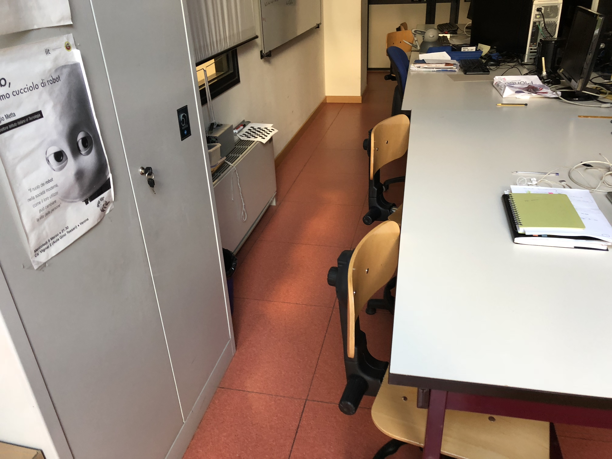
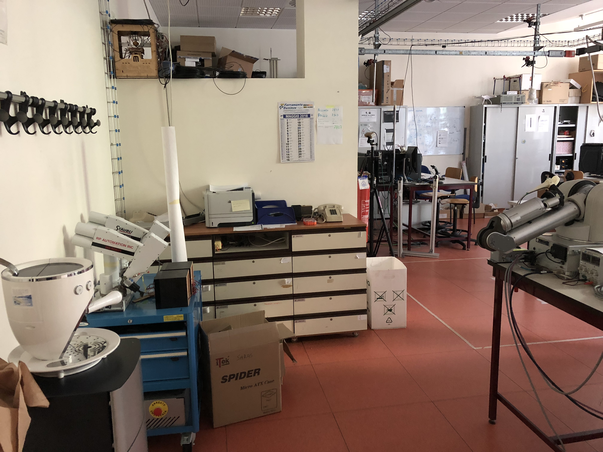
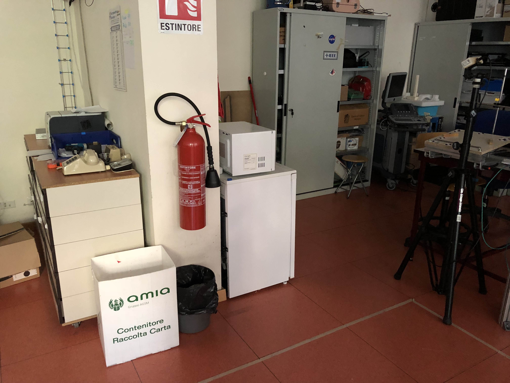

# Labiratorio ciberfisico: homework 2

## Composizione gruppo
_ Dimo Eldison: creazione mappa ed esecuzione della simulazione<br>
_ Vicario Rudy: creazione mondo Gazebo<br>

## Descrizione progetto
L'obiettivo di questo homework è la creazione di un mondo virtuale in Gazebo che riproduca una parte a scelta del dipartimento di informatica in cui poter far muovere il modello simulato di un TurtleBot3.<br>
Come scenario abbiamo scelto di ricostruire il laboratorio Altair presente nel dipartimento di Informatica (Ca' Vignal 2).<br>

### Foto del laboratorio Altair





### Mappa


## Istruzioni per l'installazione
1. Scaricare il ROS package TurtleBot3 Simulation per poter simulare TurtleBot3 sul proprio PC<br>
```console
$ cd ~/catkin_ws/src
$ git clone https://github.com/ROBOTIS-GIT/turtlebot3_simulations.git
$ cd ~/catkin_ws
$ catkin_make
```
2. Clonare questa repository ed avviare lo script "setup.sh"<br> 
```console
$ cd ~/catkin_ws/src
$ git clone https://github.com/rudyvic/lab_ciber_homework2.git
$ cd lab_ciber_homework2
$ ./setup.sh
```
## Creazione della mappa
Per creare la mappa abbiamo utilizzato <b>turtlebot3_teleop</b> che ci ha permesso di far muovere il TurtleBot3 all'interno del mondo gazebo tramite comandi da tastiera
1. Aprire un nuovo terminale e digitare
```console
$ export TURTLEBOT3_MODEL=waffle
$ roslaunch turtlebot3_gazebo turtlebot3_altair.launch
```
2. Aprire un nuovo terminale e digitare
```console
$ export TURTLEBOT3_MODEL=waffle
$ roslaunch turtlebot3_slam turtlebot3_slam.launch
```
3. Aprire un nuovo terminale e digitare
```console
$ export TURTLEBOT3_MODEL=waffle
$ rosrun rviz rviz -d `rospack find turtlebot3_slam`rviz/turtlebot3_slam.rviz
```
4. Aprire un nuovo terminale e digitare
```console
$ export TURTLEBOT3_MODEL=waffle
$ roslaunch turtlebot3_teleop turtlebot3_teleop_key.launch
```
Una volta ottenuta la mappa completa dell'ambiente, dobbiamo salvarla.<br> 
Aprire, quindi, un nuovo terminale e digitare
```console
$ export TURTLEBOT3_MODEL=waffle
$ rosrun map_server map_saver -f $HOME/environment_map
```
Dove <i>environment_map<\i> è il nome che abbiamo attribuito alla mappa appena creata.

## Navigazione autonoma
Per la navigazione autonoma abbiamo utilizzato <b>turtlebot3_navigation</b>
1. Aprire un nuovo terminale e digitare
```console
$ export TURTLEBOT3_MODEL=waffle
$ roslaunch turtlebot3_navigation turtlebot3_navigation.launch map_file:=$HOME/lab_ciber_homework2/rviz_altair_map.yaml
```
2. Aprire un nuovo terminale e digitare
```console
$ export TURTLEBOT3_MODEL=waffle
$ rosrun rviz rviz -d `rospack find turtlebot3_navigation`rviz/turtlebot3_nav.rviz
```
### Video della navigazione autonoma
[Link al download del video](https://github.com/rudyvic/lab_ciber_homework2/blob/master/video/video.MP4)
